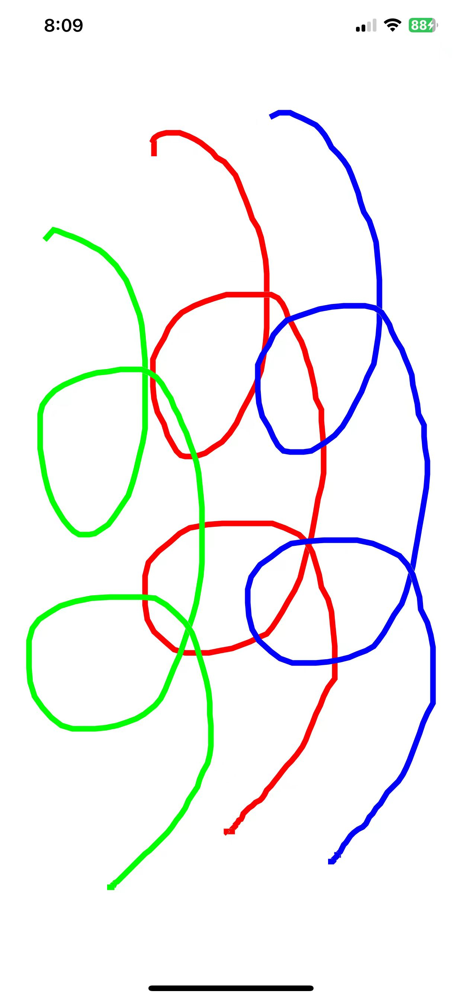

# 如何使用多点触摸事件

AWTK 内置的控件没有使用多点触摸事件，只是把触摸事件当作鼠标事件来使用。少数控件可能需要多点触摸手势事件，比如旋转和缩放手势，极少数控件可能需要原始的多点触摸事件来识别更复杂的手势。

AWTK 支持 [多点触摸手势事件](how_to_use_multi_gesture.md)，也支持原始的多点触摸事件。这里介绍一下如何使用原始的多点触摸事件。 



## 一、多点触摸事件的类型

```c
  /**
   * @const EVT_TOUCH_DOWN
   * 触摸按下事件名 (touch_event_t)。
   */
  EVT_TOUCH_DOWN,
  /**
   * @const EVT_TOUCH_MOVE
   * 触摸移动事件名 (touch_event_t)。
   */
  EVT_TOUCH_MOVE,
  /**
   * @const EVT_TOUCH_UP
   * 触摸抬起事件名 (touch_event_t)。
   */
  EVT_TOUCH_UP,
```

## 二、多点触摸事件的数据结构

```c
/**
 * @class touch_event_t
 * @annotation ["scriptable"]
 * @parent event_t
 * 多点触摸事件（目前主要对接 SDL_TouchFingerEvent(SDL_FINGERMOTION/SDL_FINGERDOWN/SDL_FINGERUP))。
 */
typedef struct _touch_event_t {
  event_t e;

  /**
   * @property {int64_t} touch_id
   * @annotation ["readable", "scriptable"]
   * 触摸 ID。
   */
  int64_t touch_id;
  /**
   * @property {int64_t} finger_id
   * @annotation ["readable", "scriptable"]
   * 手指 ID。
   */
  int64_t finger_id;
  /**
   * @property {float} x
   * @annotation ["readable", "scriptable"]
   * x 坐标（在 0-1 之间，表示与屏幕宽度的比例）。
   */
  float x;
  /**
   * @property {float} y
   * @annotation ["readable", "scriptable"]
   * y 坐标（在 0-1 之间，表示与屏幕高度的比例）。
   */
  float y;
  /**
   * @property {float} pressure
   * @annotation ["readable", "scriptable"]
   * 压力。
   */
  float pressure;

} touch_event_t;
```

x/y 在 0-1 之间，表示与屏幕宽/高度的比例，这个和 SDL 传上来的数据一致。

## 三，注册多点触摸事件

触摸事件只放给当前的窗口，所以需要在窗口上注册触摸事件。

```c
  widget_on(win, EVT_TOUCH_DOWN, on_touch_down, win);
  widget_on(win, EVT_TOUCH_UP, on_touch_up, win);
  widget_on(win, EVT_TOUCH_MOVE, on_touch_move, win);
```

## 四、支持的平台

目前支持的平台有：

* PC (SDL)
* Android
* iOS
* Web

其它平台需要自己上报触摸事件。不支持的平台，可以通过下面的函数在适配层上报：

```c
/**
 * @method main_loop_post_touch_event
 * 发送触摸事件。
 * @param {main_loop_t*} l 主循环对象。
 * @param {event_type_t} event_type 事件类型(EVT_TOUCH_DOWN/EVT_TOUCH_UP/EVT_TOUCH_MOVE)。
 * @param {xy_t} x x坐标。
 * @param {xy_t} y y坐标。
 *
 * @return {ret_t} 返回RET_OK表示成功，否则表示失败。
 */
ret_t main_loop_post_touch_event(main_loop_t* l, event_type_t event_type, xy_t x, xy_t y);
```
## 五、示例代码

完整例子请参考 [这里](https://gitee.com/zlgopen/awtk-web/tree/master/examples/AwtkApplicationCTouchEvent)。

