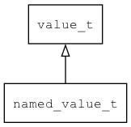

## named\_value\_t
### 概述


命名的值。
----------------------------------
### 函数
<p id="named_value_t_methods">

| 函数名称 | 说明 | 
| -------- | ------------ | 
| <a href="#named_value_t_named_value_cast">named\_value\_cast</a> | 转换为named_value对象(供脚本语言使用)。 |
| <a href="#named_value_t_named_value_compare">named\_value\_compare</a> | 比较。 |
| <a href="#named_value_t_named_value_compare_by_name">named\_value\_compare\_by\_name</a> | 比较。 |
| <a href="#named_value_t_named_value_create">named\_value\_create</a> | 创建named_value对象。 |
| <a href="#named_value_t_named_value_create_ex">named\_value\_create\_ex</a> | 创建named_value对象。 |
| <a href="#named_value_t_named_value_deinit">named\_value\_deinit</a> | 重置named_value对象。 |
| <a href="#named_value_t_named_value_destroy">named\_value\_destroy</a> | 销毁named_value对象。 |
| <a href="#named_value_t_named_value_get_value">named\_value\_get\_value</a> | 获取值对象(主要给脚本语言使用)。 |
| <a href="#named_value_t_named_value_icompare">named\_value\_icompare</a> | 大小写不敏感比较。 |
| <a href="#named_value_t_named_value_icompare_by_name">named\_value\_icompare\_by\_name</a> | 大小写不敏感比较。 |
| <a href="#named_value_t_named_value_init">named\_value\_init</a> | 初始化。 |
| <a href="#named_value_t_named_value_set_name">named\_value\_set\_name</a> | 设置名称。 |
| <a href="#named_value_t_named_value_set_value">named\_value\_set\_value</a> | 设置值。 |
### 属性
<p id="named_value_t_properties">

| 属性名称 | 类型 | 说明 | 
| -------- | ----- | ------------ | 
| <a href="#named_value_t_name">name</a> | char* | 名称。 |
| <a href="#named_value_t_value">value</a> | value\_t | 值。 |
#### named\_value\_cast 函数
-----------------------

* 函数功能：

> <p id="named_value_t_named_value_cast">转换为named_value对象(供脚本语言使用)。

* 函数原型：

```
named_value_t* named_value_cast (named_value_t* nv);
```

* 参数说明：

| 参数 | 类型 | 说明 |
| -------- | ----- | --------- |
| 返回值 | named\_value\_t* | 返回named\_value对象。 |
| nv | named\_value\_t* | named\_value对象。 |
#### named\_value\_compare 函数
-----------------------

* 函数功能：

> <p id="named_value_t_named_value_compare">比较。

* 函数原型：

```
int32_t named_value_compare (named_value_t* nv, const named_value_t* other);
```

* 参数说明：

| 参数 | 类型 | 说明 |
| -------- | ----- | --------- |
| 返回值 | int32\_t | 返回RET\_OK表示成功，否则表示失败。 |
| nv | named\_value\_t* | named\_value对象。 |
| other | const named\_value\_t* | named\_value对象。 |
#### named\_value\_compare\_by\_name 函数
-----------------------

* 函数功能：

> <p id="named_value_t_named_value_compare_by_name">比较。

* 函数原型：

```
int32_t named_value_compare_by_name (named_value_t* nv, const char* name);
```

* 参数说明：

| 参数 | 类型 | 说明 |
| -------- | ----- | --------- |
| 返回值 | int32\_t | 返回RET\_OK表示成功，否则表示失败。 |
| nv | named\_value\_t* | named\_value对象。 |
| name | const char* | 名称。 |
#### named\_value\_create 函数
-----------------------

* 函数功能：

> <p id="named_value_t_named_value_create">创建named_value对象。

* 函数原型：

```
named_value_t* named_value_create ();
```

* 参数说明：

| 参数 | 类型 | 说明 |
| -------- | ----- | --------- |
| 返回值 | named\_value\_t* | 返回named\_value对象。 |
#### named\_value\_create\_ex 函数
-----------------------

* 函数功能：

> <p id="named_value_t_named_value_create_ex">创建named_value对象。

* 函数原型：

```
named_value_t* named_value_create_ex (const char* name, const value_t* value);
```

* 参数说明：

| 参数 | 类型 | 说明 |
| -------- | ----- | --------- |
| 返回值 | named\_value\_t* | 返回named\_value对象。 |
| name | const char* | 名称。 |
| value | const value\_t* | 值。 |
#### named\_value\_deinit 函数
-----------------------

* 函数功能：

> <p id="named_value_t_named_value_deinit">重置named_value对象。

* 函数原型：

```
ret_t named_value_deinit (named_value_t* nv);
```

* 参数说明：

| 参数 | 类型 | 说明 |
| -------- | ----- | --------- |
| 返回值 | ret\_t | 返回RET\_OK表示成功，否则表示失败。 |
| nv | named\_value\_t* | named\_value对象。 |
#### named\_value\_destroy 函数
-----------------------

* 函数功能：

> <p id="named_value_t_named_value_destroy">销毁named_value对象。

* 函数原型：

```
ret_t named_value_destroy (named_value_t* nv);
```

* 参数说明：

| 参数 | 类型 | 说明 |
| -------- | ----- | --------- |
| 返回值 | ret\_t | 返回RET\_OK表示成功，否则表示失败。 |
| nv | named\_value\_t* | named\_value对象。 |
#### named\_value\_get\_value 函数
-----------------------

* 函数功能：

> <p id="named_value_t_named_value_get_value">获取值对象(主要给脚本语言使用)。

* 函数原型：

```
value_t* named_value_get_value (named_value_t* nv);
```

* 参数说明：

| 参数 | 类型 | 说明 |
| -------- | ----- | --------- |
| 返回值 | value\_t* | 返回值对象。 |
| nv | named\_value\_t* | named\_value对象。 |
#### named\_value\_icompare 函数
-----------------------

* 函数功能：

> <p id="named_value_t_named_value_icompare">大小写不敏感比较。

* 函数原型：

```
int32_t named_value_icompare (named_value_t* nv, const named_value_t* other);
```

* 参数说明：

| 参数 | 类型 | 说明 |
| -------- | ----- | --------- |
| 返回值 | int32\_t | 返回RET\_OK表示成功，否则表示失败。 |
| nv | named\_value\_t* | named\_value对象。 |
| other | const named\_value\_t* | named\_value对象。 |
#### named\_value\_icompare\_by\_name 函数
-----------------------

* 函数功能：

> <p id="named_value_t_named_value_icompare_by_name">大小写不敏感比较。

* 函数原型：

```
int32_t named_value_icompare_by_name (named_value_t* nv, const char* name);
```

* 参数说明：

| 参数 | 类型 | 说明 |
| -------- | ----- | --------- |
| 返回值 | int32\_t | 返回RET\_OK表示成功，否则表示失败。 |
| nv | named\_value\_t* | named\_value对象。 |
| name | const char* | 名称。 |
#### named\_value\_init 函数
-----------------------

* 函数功能：

> <p id="named_value_t_named_value_init">初始化。

* 函数原型：

```
named_value_t* named_value_init (named_value_t* nv, const char* name, const value_t* value);
```

* 参数说明：

| 参数 | 类型 | 说明 |
| -------- | ----- | --------- |
| 返回值 | named\_value\_t* | 返回named\_value对象。 |
| nv | named\_value\_t* | named\_value对象。 |
| name | const char* | 名称。 |
| value | const value\_t* | 值。 |
#### named\_value\_set\_name 函数
-----------------------

* 函数功能：

> <p id="named_value_t_named_value_set_name">设置名称。

* 函数原型：

```
ret_t named_value_set_name (named_value_t* nv, const char* name);
```

* 参数说明：

| 参数 | 类型 | 说明 |
| -------- | ----- | --------- |
| 返回值 | ret\_t | 返回RET\_OK表示成功，否则表示失败。 |
| nv | named\_value\_t* | named\_value对象。 |
| name | const char* | 名称。 |
#### named\_value\_set\_value 函数
-----------------------

* 函数功能：

> <p id="named_value_t_named_value_set_value">设置值。

* 函数原型：

```
ret_t named_value_set_value (named_value_t* nv, const value_t* value);
```

* 参数说明：

| 参数 | 类型 | 说明 |
| -------- | ----- | --------- |
| 返回值 | ret\_t | 返回RET\_OK表示成功，否则表示失败。 |
| nv | named\_value\_t* | named\_value对象。 |
| value | const value\_t* | 值。 |
#### name 属性
-----------------------
> <p id="named_value_t_name">名称。

* 类型：char*

| 特性 | 是否支持 |
| -------- | ----- |
| 可直接读取 | 是 |
| 可直接修改 | 否 |
| 可脚本化   | 是 |
#### value 属性
-----------------------
> <p id="named_value_t_value">值。

* 类型：value\_t

| 特性 | 是否支持 |
| -------- | ----- |
| 可直接读取 | 是 |
| 可直接修改 | 否 |
